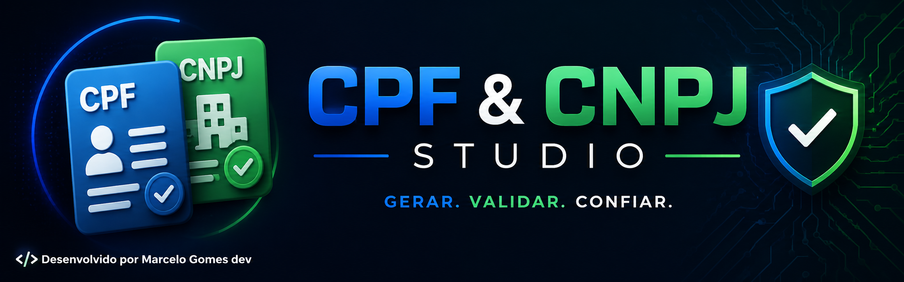
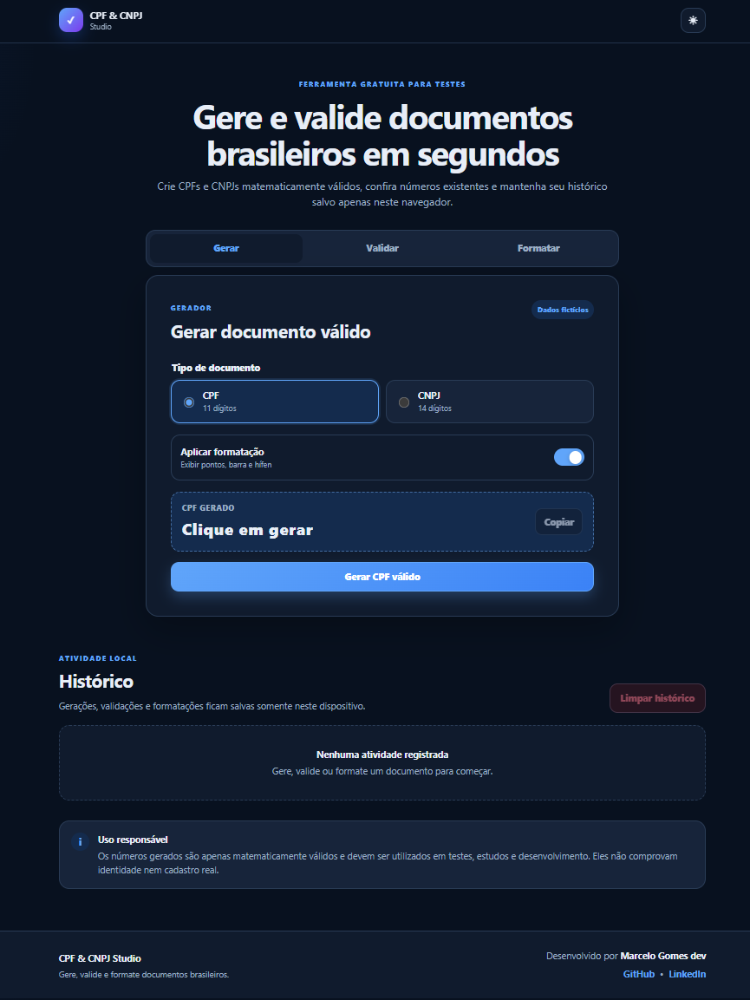
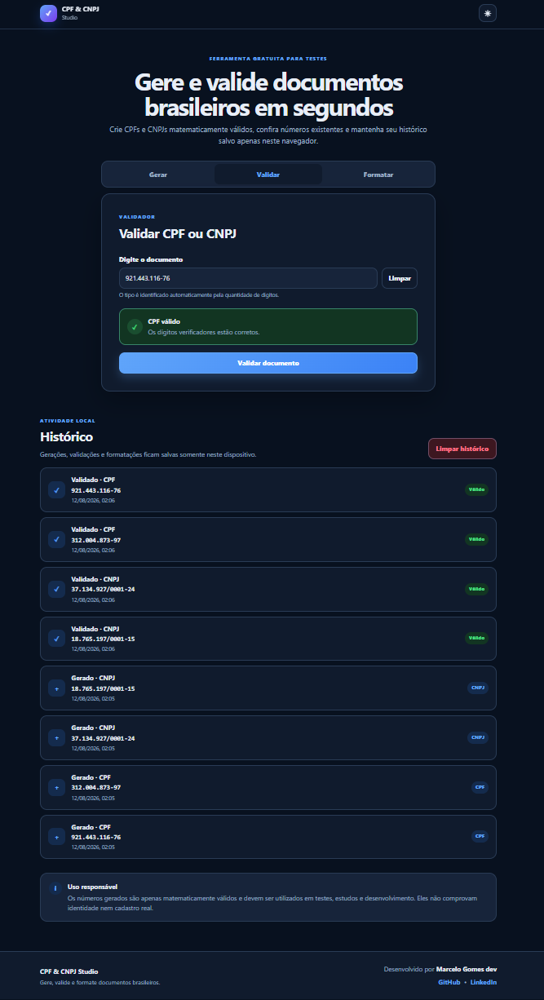
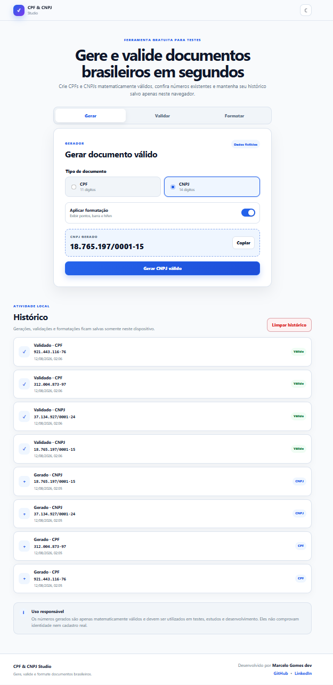

<p align="center">  </p>

CPF & CNPJ Studio

Aplicação web moderna e responsiva para gerar, validar e formatar CPF e CNPJ diretamente no navegador, com histórico local, cópia rápida e suporte aos modos claro e escuro.

Projeto desenvolvido com foco em prática de JavaScript, manipulação do DOM, algoritmos de validação, persistência de dados e desenvolvimento de interfaces responsivas.

## 🚀 Acessar o projeto

🌐 [Acessar CPF & CNPJ Studio](https://marcelogomesdev.github.io/cpf-cnpj-studio/)

📸 Preview



---

## ✨ Funcionalidades

* 🔢 Geração de **CPF matematicamente válido**
* 🏢 Geração de **CNPJ matematicamente válido**
* ✅ Validação de CPF e CNPJ por meio dos dígitos verificadores
* 🔎 Identificação automática entre CPF e CNPJ
* 🎭 Aplicação e remoção de formatação
* 📋 Cópia rápida dos resultados
* 🕘 Histórico de gerações, validações e formatações
* 💾 Persistência do histórico com **LocalStorage**
* 🗑️ Opção para limpar o histórico
* 🔔 Mensagens de sucesso e erro
* 🌙 Modo claro e escuro
* 📱 Interface responsiva para diferentes tamanhos de tela
* ♿ Boas práticas básicas de acessibilidade

---

## 🖼️ Screenshots

### Histórico de operações

O sistema mantém um histórico das gerações, validações e formatações realizadas durante o uso.



### Modo claro

Além da interface em modo escuro, o projeto também oferece um tema claro para adaptar a experiência de visualização.



---

## 🛠️ Tecnologias utilizadas

* **HTML5** — estrutura semântica da aplicação
* **CSS3** — estilização, responsividade e temas
* **JavaScript ES6+** — regras de negócio e interatividade
* **LocalStorage** — persistência do histórico e preferências

---

## 🧠 Conceitos praticados

Durante o desenvolvimento deste projeto foram aplicados conceitos como:

* Manipulação do DOM
* Eventos com JavaScript
* Funções e modularização de código
* Algoritmos de cálculo de dígitos verificadores
* Validação e tratamento de entradas
* Máscaras e formatação de documentos
* Persistência de dados no navegador
* Feedback visual para o usuário
* Responsividade
* Alternância entre temas

---

## 📂 Estrutura do projeto

```text
cpf-cnpj-studio/
├── index.html
├── css/
│   └── style.css
├── js/
│   └── script.js
├── images/
│   ├── favicon.svg
│   ├── cpf-cnpj-studio-home.png
│   ├── cpf-cnpj-studio-history.png
│   └── cpf-cnpj-studio-claro.png
├── README.md
└── LICENSE
```

---

## 🚀 Executando o projeto

### Opção 1 — Diretamente no navegador

Clone o repositório:

```bash
git clone https://github.com/marcelogomesdev/cpf-cnpj-studio.git
```

Entre na pasta do projeto:

```bash
cd cpf-cnpj-studio
```

Abra o arquivo `index.html` no navegador.

### Opção 2 — Live Server

Se estiver utilizando o **Visual Studio Code**, você também pode executar o projeto utilizando a extensão **Live Server**.

1. Abra a pasta do projeto no VS Code.
2. Clique com o botão direito sobre `index.html`.
3. Selecione **Open with Live Server**.

---

## 🌐 GitHub Pages

O projeto pode ser publicado gratuitamente utilizando o GitHub Pages.

1. Acesse **Settings** no repositório.
2. Selecione **Pages**.
3. Em **Build and deployment**, escolha **Deploy from a branch**.
4. Selecione a branch `main`.
5. Escolha `/ (root)`.
6. Clique em **Save**.

Após o deploy, a aplicação poderá ser utilizada diretamente pelo navegador, sem necessidade de instalação.

---

## ⚠️ Aviso

Os números de CPF e CNPJ gerados por esta aplicação são **apenas matematicamente válidos**, seguindo os respectivos algoritmos de cálculo dos dígitos verificadores.

Isso não significa que os documentos estejam cadastrados ou sejam oficialmente válidos perante órgãos governamentais.

O projeto foi desenvolvido exclusivamente para fins de **estudo, desenvolvimento e testes de software**.

---

## 👨‍💻 Autor

**Marcelo Gomes dev**

Desenvolvido como parte do meu portfólio de projetos em desenvolvimento web.

* GitHub: `marcelogomesdev`
* LinkedIn: `marcelogomesdev`

---

## 📄 Licença

Este projeto está distribuído sob a licença **MIT**.

---

⭐ Se este projeto foi útil ou chamou sua atenção, considere deixar uma estrela no repositório.
